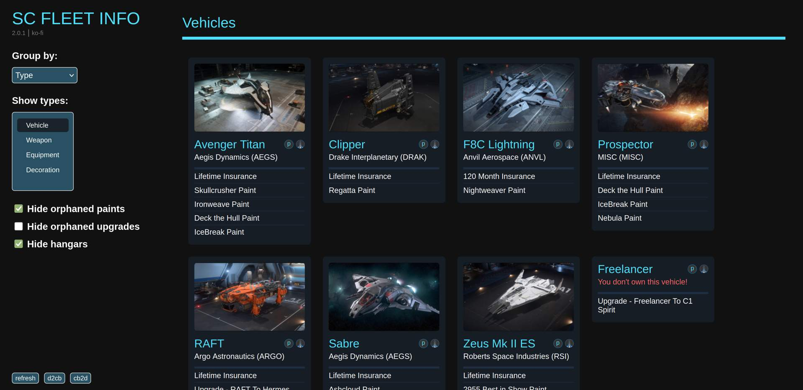

## Star Citizen - Fleet Info V2

This creates a new page showing all your ships and other possessions for the game Star Citizen in a compact overview including filters, grouping and other features. It works by reading out the pledge data directly from https://robertsspaceindustries.com for the currently logged in user.

## How to use

# As a user script

Use a user script injection extension of your choice. \
A list of popular ones can be found here: https://en.wikipedia.org/wiki/List_of_augmented_browsing_software \
I still use https://github.com/Lor-Saba/Code-Injector, which is abandoned, so i can't recommend it anymore.

You need to inject the contents of this JavaScript file: https://github.com/sophie-la-li/sc-fleet-info-v2/releases/latest/download/sc-fleet-info-injector.js \
Into all sub pages of: https://robertsspaceindustries.com/en/account

Updates will reach you automatically.

# As a browser extension

As signing and publishing bespoke browser extensions is a bit cumbersome and also has some legal implications, i hesitate to do that right now. 

So all who might want to use the extension mode have to download this repository and use their browers development tools to enable an extension using the manifest file you can find in the Chrome or Firefix extension directories. You need to copy all files from the src directly over to the extension directory first or use `make pack-all`. They should execute just fine. 

The update files in the root of this repository are NOT maintained right now.

## Copyright & License

Copyright (c) Sophie Kühn

This software, repository, account and maintainer are by no means connected to Roberts Space Industries or Cloud Imperium Games. All rights to Star Citizen and robertsspaceindustries.com remain with them.

This application is made available under the GNU General Public License v3.0.  
Please see the [LICENSE](LICENSE) file for further details.
